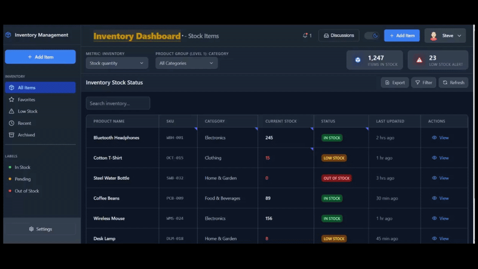
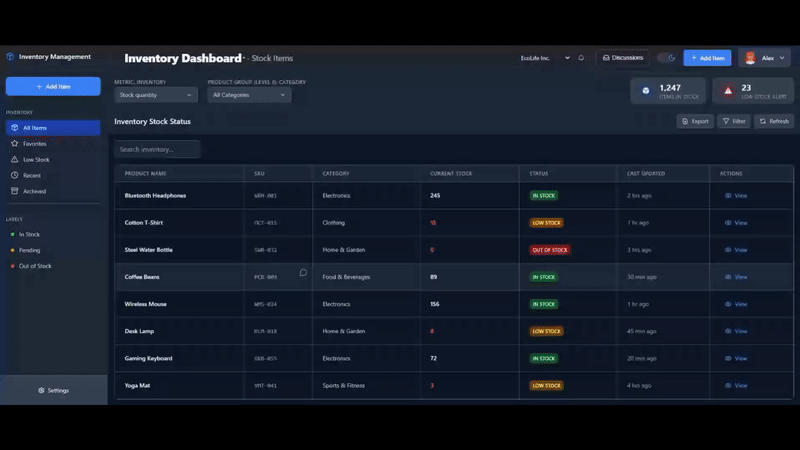
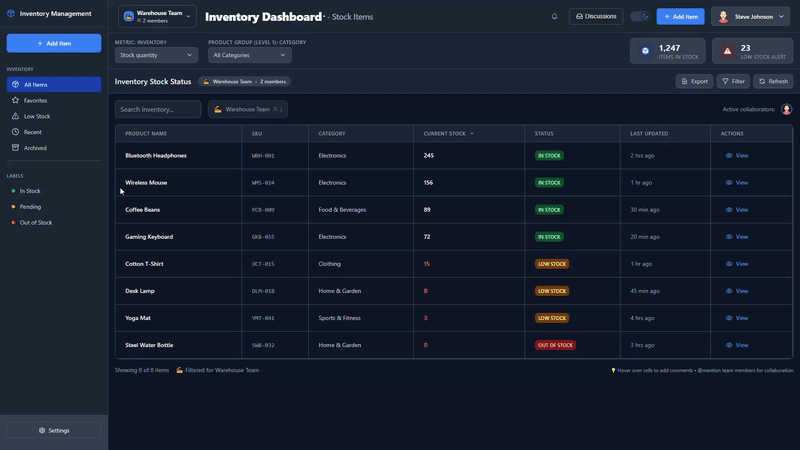
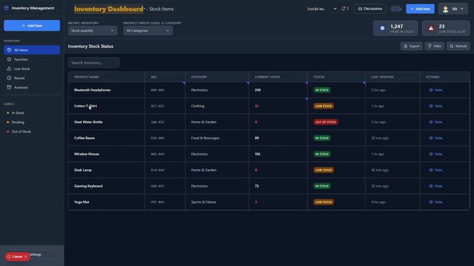
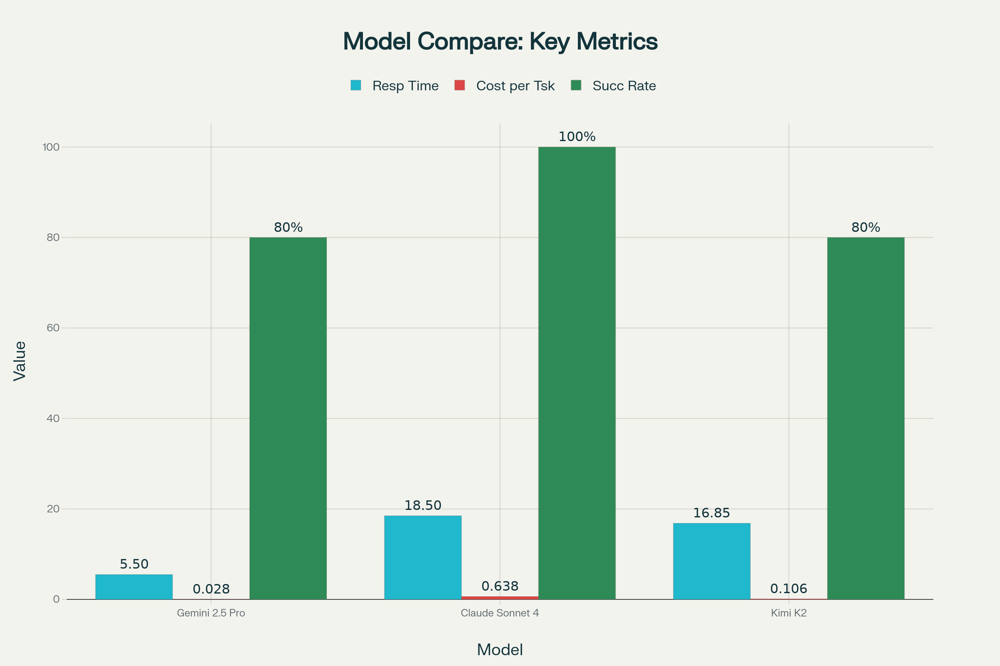

All new LLMs promise to speed up your workflow, but which one actually delivers? I tested Claude Sonnet 4, Gemini 2.5 Pro, and Kimi K2 on a real Next.js app - measuring cost, speed, and code quality. By the end, you’ll know which AI works best for production features, daily dev tasks, and quick fixes.

<!--truncate-->

## **TL;DR**

If you want to skip straight to the results and see which AI ships working code, here are the results:

- **For production features where bugs = lost money,** Claude Sonnet 4 wins. Zero TypeScript errors, complete feature implementation, but costs $3.19 per task (23× more than Gemini).

- **For daily development work:** Kimi K2 hits the sweet spot. Catches all performance bugs, builds working UIs, and costs only $0.53 per task. Just leaves you occasional TODO comments for complex integrations, which it later resolves with a new prompt.

- **For quick fixes and experiments:** Gemini 2.5 Pro is lightning fast (3-8 seconds response time) and very affordable ($0.14 per task), but it requires multiple prompt iterations to work effectively.

Claude costs 23× more than Gemini, but when Claude responds, it’s almost perfect what we’re expecting. Apart from some minor UI issues, but functionality it builds very well.


For me, I’ll choose Claude. It gets the job done, which is what I want at the end of the day.

<!--truncate-->

## Testing Methodology and Setup

Each model was tested on the same real Next.js app. I introduced real bugs, asked for new features, and evaluated how well each model could debug, refactor, and add code without causing other problems. I also used a tool(Velt) in this app, so I attached a doc link(in a prompt) to give them context about what the tool is.

### Test Environment Specifications

- **Stack:** TypeScript, Next.js 15.2.2, React 19
- **Codebase Size:** 5,247 lines across 49 modular files
- **App Structure:** Uses Next.js app directory and server components
- **Live Collaboration:** Integrated with Velt SDK for real-time multi-user features

### **Task Breakdown**

This is the app where I will test all these models. To give you some context, this app is an inventory management dashboard where multiple users can comment or give suggestions using the Velt tool. This is how the app currently works.



I've added some bugs and issues, like a memoization problem, a re-rendering issue, and a user persistence issue. I want to add a new feature that allows users to switch organizations, so only users related to a specific organization can see that organization's comments and users. The task for these models is to fix all the bugs and implement this new feature.

### Evaluation Criteria

The criteria are straightforward:

- The code must be error-free with no TypeScript or ESLint issues
- Properly follow the prompt and stay on task
- The overall code quality
- How much time does the model take to finish the tasks, and in how many iterations
- Lastly, we'll check the token efficiency

## **Agentic Coding Comparison**

**Prompt Used:**

```markdown
This inventory management app uses Velt for real-time collaboration and commenting. The code should always set a document context using useSetDocument so Velt features like comments and presence work correctly, and users should be associated with a common organization ID for proper tagging and access. Please review the provided files and fix any issues related to missing document context, organization ID usage, and ensure Velt collaboration features function as intended.
```

Here’s the result output in case you want to see the output:

**Gemini 2.5 Pro:**



Gemini was very fast, responding in **3-8 seconds** per request, which made it feel quick during development. It implemented the feature I requested and fixed the issues. It added the new organization switch option, but I had to provide a separate prompt for it.

**Claude Sonnet 4:**



Claude took 13–25 seconds to respond, which felt slow in the middle of an active dev session. But once it replied, it mostly got things right. It handled the feature and bug fixes well. I only had to fix a few CSS issues. The UI wasn’t perfect, but the functionality worked exactly as expected.

**Kimi K2:**



Kimi responded in 11–20 seconds, right between Claude and Gemini. It spotted all the performance issues and fixed them properly. It also built a working organization switcher, which was nice to see. But when it came to wiring up user isolation for Velt comments, it stopped short and left a TODO: *“you need to implement the filtering logic here.”* So, it got most things right, but still needed me to finish it off, or I need to provide another prompt for the rest of the implementation.

## **Performance Analysis**

### **Execution Metrics**

| **Model** | **Success Rate** | **First-Attempt Success** | **Response Time** | **Bug Detection** | **Prompt Adherence** | **Notes** |
| --- | --- | --- | --- | --- | --- | --- |
| **Gemini 2.5 Pro** | 4/5 | 3/5 | 3-8 s | 5/5 | 3/5 | Fastest replies and fixed all bugs in a single prompt, but skipped the org-switch feature until it got a second prompt. |
| **Claude Sonnet 4** | 5/5 | 4/5 | 13-25 s | 4/5 | 5/5 | Added full org-switch feature and fixed every major bug, but  needed a quick follow-up to fix a non-responsive UI element. |
| **Kimi K2** | 4/5 | 2/5 | 11-20 s | 5/5 | 3/5 | Fixed every bug, shipped a working dropdown for org switching, but stopped short of wiring Velt filtering, left TODO comments for the hard part. |

**Claude Sonnet 4** dominated with perfect task completion, solving mostly every task on the first attempt without requiring any heavy debugging iterations. **Kimi K2** emerged as a strong second place, completing 4 out of 5 tasks with excellent debugging capabilities, but failing the complex organization switcher implementation. **Gemini 2.5 Pro** showed decent results but required multiple iterations for half the tasks.

### Token Usage and Cost Analysis

| Metric | Gemini 2.5 Pro | Claude Sonnet 4 | Kimi K2 | Notes |
| --- | --- | --- | --- | --- |
| **Total Tokens Used** | 11,700 | 79,950 | ~60,200 | Claude processed full codebase context |
| **Input Tokens** | ~8,200 | 79,665 | ~54,000 | Gemini relied on minimal input, needed retries |
| **Output Tokens** | ~3,500 | 285 | ~6,200 | Claude's replies were compact but complete |
| **Total Cost** | $0.14 | $3.19 | $0.53 | 23x cost gap between Claude and Gemini |
| **Cost per Task** | $0.028 | $0.638 | $0.106 | Gemini is cheapest, Claude is most accurate |
| **Token Efficiency** | High | Low (high input, low output) | Moderate | Gemini optimized for minimal usage, not always accuracy |

The cost analysis shows a **23x price difference** between the cheapest (Gemini) and most expensive (Claude) solutions. **Gemini 2.5 Pro** proved most token-efficient at just $0.028 per task, while **Claude Sonnet 4's** premium pricing at $0.638 per task reflects its zero-iteration requirement and perfect execution. **Kimi K2** positioned itself as the practical middle ground at $0.106 per task, nearly **6x cheaper than Claude** while maintaining strong performance.

## Speed and Token Economics: Where Your Time and Money Actually Go

When it comes to response speed across the three models, the differences were more dramatic than I expected. For typical coding prompts averaging 1,500-2,000 tokens of context, **Gemini 2.5 Pro** was consistently the fastest at around 3-8 seconds total response time, while **Claude Sonnet 4** took significantly longer at 13-25 seconds, and **Kimi K2** fell somewhere in between at 11-20 seconds.



Many developers focus on tokens-per-second metrics, but for coding tasks, total response time matters more than streaming speed since you're reading complete solutions.

However, if we compare the time to first token (TTFT), **Gemini** had nearly instant responses, usually under 2 seconds, while **Claude** showed noticeable latency of 13-25 seconds before any output appeared. **Kimi K2** started responding within 11-20 seconds, making it feel more responsive than Claude despite similar total completion times.

**Claude Sonnet 4** behaves more like a reasoning model, consuming massive context (79,665 input tokens) to deeply analyze the entire codebase before generating compact, precise responses (just 285 output tokens). Its token usage pattern suggests it's essentially "thinking" through the entire project architecture before responding, explaining both the accuracy and the cost.

Now, if we look at overall token consumption patterns,

- **Claude** used dramatically more tokens than the others, nearly 7x more than Gemini's 11,700 tokens.
- **Kimi K2** fell in the middle with ~60,200 tokens, showing it processes substantial context but generates more verbose explanations than Claude's terse perfection.

But there's a frustrating catch with **Claude's premium pricing model**.

One thing that consistently surprised me was how Claude's token costs scale so aggressively. At $3.19 per session, it's expensive enough that you start second-guessing whether to ask follow-up questions, which completely changes how you interact with the model. Meanwhile, **Gemini** at $0.14 per session felt essentially free to experiment with, and **Kimi K2** at $0.53 struck a reasonable middle ground where cost wasn't a constant concern.

## Final Verdict

Choosing between them is a bit of a tough call, but I'm sticking with Claude Sonnet 4. Yes, it costs more than Gemini and Kimi, but it gets the job done. No back-and-forth, no strange bugs, just reliable code. Kimi K2 is okay for daily tasks, and Gemini is good for quick answers. But when it counts, like for production code, Claude is the only one who doesn't waste my time. If you're tired of fixing AI mistakes, don't just go for speed or savings. Use the model that works right. For me, that's Claude.

---

## Related Posts

1. [Kimi K2 vs Grok 4](https://forgecode.dev/blog/kimi-k2-vs-grok-4-comparison-full/)
2. [Claude Opus 4 vs. Grok 4 Coding Comparison](https://forgecode.dev/blog/claude-4-opus-vs-grok-4-comparison-full)
3. [Claude Opus 4 vs. Gemini 2.5 Pro](https://forgecode.dev/blog/claude-sonnet-4-vs-gemini-2-5-pro-preview-coding-comparison)

---

## Footnotes

<a id="footnote-1"></a>**1.** Moonshot AI. "Access Kimi K2 via API." [https://platform.moonshot.ai](https://platform.moonshot.ai) [↩](#ref-1)

<a id="footnote-2"></a>**2.** Velt. "Collaborative Comments using Velt." [https://docs.velt.dev/](https://docs.velt.dev/async-collaboration/comments/overview) [↩](#ref-2)


<a id="footnote-3"></a>**3.** Anthropic. "Claude 4 Models Pricing." [https://www.anthropic.com/pricing#api](https://www.anthropic.com/pricing#api) [↩](#ref-3)


<a id="footnote-4"></a>**4.** Artificial Analysis. “Kimi K2 Model Card." [https://artificialanalysis.ai/models/kimi-k2](https://artificialanalysis.ai/models/kimi-k2) [↩](#ref-4)

<a id="footnote-5"></a>**5.** Gemini. “Google Gemini Page." [https://deepmind.google/models/gemini/pro/](https://deepmind.google/models/gemini/pro/) [↩](#ref-5)


